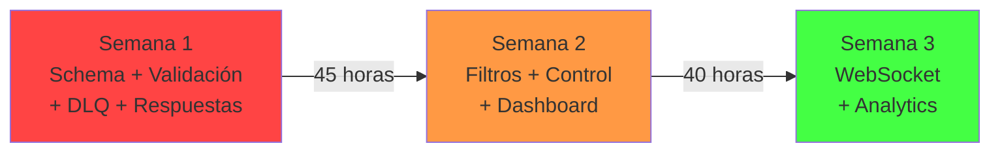

# Resumen Ejecutivo - Revisión Módulo Mensajes 📋

## TL;DR (Lo Más Importante)

Tu módulo de mensajes **funciona bien para enviar**, pero **no está completo para campañas profesionales**.

**Falta:** Monitoreo avanzado, análisis de respuestas, segmentación fina, recuperación de errores y control de campañas.

**Impacto:** Sin esto, no sabes si tus mensajes funcionan, quién respondió, o qué hacer si algo falla.

---

## Estado Actual ✅

| Área | Status | Nota |
|------|--------|------|
| **Envío masivo** | ✅ Completo | Funciona con BullMQ + Redis |
| **Almacenamiento** | ✅ Completo | Modelo Mensaje + Campana en BD |
| **Líneas WhatsApp** | ✅ Básico | Existen pero sin UI de gestión |
| **Procesamiento inbound (IA)** | ✅ Funciona | Análisis con Gemini, pero sin UI |
| **Multimedia** | ✅ Funciona | Imágenes/videos por Supabase |
| **Encuestas/Polls** | ⚠️ Parcial | Estructura en BD, no en UI |
| **Monitoreo** | ⚠️ Débil | Polling cada 3 seg, ineficiente |
| **Filtros** | ❌ Muy básicos | Solo barrio + intención de voto |
| **Respuestas** | ❌ Procesadas pero no visibles | IA las analiza pero no UI |
| **Errores** | ❌ Silenciosos | Se descartan sin registrar |
| **Control de campañas** | ❌ Nulo | No puedes pausar/cancelar |

---

## Lo Que Necesitas Ahora vs Después

### 🔴 **AHORA - Crítico (2 semanas):**
```
1. Bandeja de respuestas (¿qué dijeron los ciudadanos?)
2. Filtros avanzados (segmentar realmente la audiencia)
3. Control de campañas (pausar, cancelar, duplicar)
4. Manejo de errores (saber qué falló)
5. Validación robusta (evitar errores costosos)
```

### 🟠 **DESPUÉS - Importante (1-2 semanas más):**
```
6. Gestión de líneas WhatsApp (diagnosticar problemas)
7. Plantillas de mensajes (campaña recurrentes)
8. WebSocket (reemplazar polling)
9. Analytics detallado (medir impacto)
10. A/B Testing (optimizar mensajes)
```

### 🟡 **NICE-TO-HAVE - Pulido:**
```
11. Integración con Líderes/Eventos
12. Exportar reportes
13. Predicción de engagement (IA)
```

---

## Impacto Funcional: Antes vs Después

### ANTES (Ahora)
```
1. Escribes mensaje → 2. Seleccionas audiencia (básico) → 3. Envías
   ↓
4. Ves números de progreso (sin saber por qué fallan)
5. Respuestas se pierden en WhatsApp
6. ❌ No sabes qué funcionó
```

### DESPUÉS (Con lo que falta)
```
1. Escribes (o usas plantilla) → 2. Segmentas finamente → 3. Envías
   ↓
4. **Monitoreas en tiempo real** (WebSocket)
5. **Ves qué personas respondieron** + sentimiento
6. **Recuperas errores** manualmente o automáticamente
7. **Pausas/Cancelas** si algo sale mal
8. **Analizas impacto:** ¿A qué barrio le funcionó? ¿Qué mensaje?
9. ✅ Sabes exactamente qué funcionó y qué no
```

---

## Deuda Técnica Detectada

| Problema | Severidad | Solución |
|----------|-----------|----------|
| **Polling cada 3 seg** | Media | WebSocket (Fase 3) |
| **Sin DLQ** | Alta | MensajeError table + reintentos |
| **Errores silenciosos** | Alta | Logging completo |
| **Filtros hardcodeados** | Alta | Query builder dinámico |
| **Respuestas ocultas** | Alta | Dashboard + conversaciones |
| **Sin auditoría** | Media | Usar tabla Auditoria existente |
| **Validación débil** | Media | Zod schemas |
| **Índices insuficientes** | Baja | Agregar índices a BD |

---

## Hoja de Ruta (3 semanas)



### Semana 1 (Prioridad Alta)
- ✅ Extender schema Prisma (+4 tablas)
- ✅ Validación Zod en endpoints
- ✅ Dead Letter Queue para errores
- ✅ Endpoint de respuestas inbound

**Resultado:** Sistema confiable, errores registrados, respuestas visibles.

### Semana 2 (Prioridad Media)
- ✅ Filtros avanzados (fecha, puesto, búsqueda)
- ✅ Control de campañas (pausar/cancelar)
- ✅ Dashboard de respuestas
- ✅ Plantillas de mensajes

**Resultado:** Campaña profesional con control total.

### Semana 3 (Prioridad Baja)
- ✅ WebSocket reemplaza polling
- ✅ Analytics en tiempo real
- ✅ Optimizaciones de performance

**Resultado:** Sistema escalable y eficiente.

---

## Esfuerzo vs Impacto

```
MUY IMPACTO, POCO ESFUERZO (Hacer PRIMERO):
├─ Validación Zod → 2 horas, previene bugs costosos
├─ Respuestas inbound UI → 5 horas, ve qué dijeron
├─ Control campañas → 2 horas, pausas/cancelas

IMPACTO ALTO, ESFUERZO MEDIO (Hacer SEGUNDO):
├─ DLQ + Error handling → 4 horas, recuperas mensajes
├─ Filtros avanzados → 5 horas, segmenta bien
└─ Dashboard respuestas → 6 horas, analiza feedback

IMPACTO MEDIO, ESFUERZO ALTO (Hacer DESPUÉS):
├─ WebSocket → 8 horas, mejora UX
├─ Analytics gráficos → 4 horas, visualiza datos
└─ Gestión líneas → 5 horas, diagnostica
```

---

## Fichero de Cambios (By Impact)

### 🔴 P0 - MUST HAVE
```
prisma/schema.prisma
  → Agregar: Mensaje.es_respuesta, requiere_accion, etc
  → Agregar: Campana.pausada_en, cancelada_en, etc
  → Crear: MensajeError, PlantillaMensaje

lib/validation.ts (nueva)
  → Zod schemas para validación

lib/whatsapp/queue.ts
  → Agregar: setupErrorHandlers()

app/api/mensajes/enviar/route.ts
  → Usar: schemaEnviarCampana.safeParse()

app/api/mensajes/errores/route.ts (nueva)
  → GET: Listar errores
  → POST: Resolver/reintentar

app/api/mensajes/respuestas/route.ts (nueva)
  → GET: Listar respuestas por campaña

app/api/campanas/[id]/estado/route.ts (nueva)
  → POST: pausar, reanudar, cancelar

app/(dashboard)/mensajes/respuestas/page.tsx (nueva)
  → UI para ver respuestas de ciudadanos
```

### 🟠 P1 - SHOULD HAVE
```
lib/whatsapp/filters.ts (nueva)
  → buildContactoFilters() para query dinámica

app/api/contactos/filtrar/route.ts (nueva)
  → GET: Contactos con filtros avanzados

app/api/plantillas/route.ts (nueva)
  → CRUD de plantillas

app/(dashboard)/mensajes/plantillas/page.tsx (nueva)
  → Gestión de plantillas
```

### 🟡 P2 - NICE-TO-HAVE
```
lib/socket-server.ts (nueva)
  → Configuración Socket.io

app/api/socket/route.ts (nueva)
  → Handler HTTP para Socket

app/(dashboard)/mensajes/lineas/page.tsx (nueva)
  → Gestión de líneas WhatsApp

app/(dashboard)/mensajes/analytics/page.tsx (nueva)
  → Gráficos de performance
```

---

## KPIs a Medir (Después)

Cuando implementes todo, podrás medir:

```
✅ Tasa de entrega: % mensajes entregados vs enviados
✅ Tasa de respuesta: % ciudadanos que respondieron
✅ Tasa de conversión: % respuestas positivas
✅ Tiempo de respuesta: Cuánto tardan en responder
✅ Eficiencia por línea: Qué línea WhatsApp funciona mejor
✅ Segmentación: Qué barrio/audiencia responde mejor
✅ Impacto de mensaje: Qué tipo de texto genera más respuestas
```

---

## Recursos Necesarios

### Para Implementación
- 1 desarrollador fullstack (Next.js + Prisma)
- 2-3 semanas a tiempo completo
- Acceso a: Prisma, Redis, Socket.io, Zod

### Para Testing
- Línea WhatsApp de prueba
- Base de datos de contactos ficticia (para QA)
- Plan: enviar 1000 mensajes de prueba

### Para Monitoring (Después)
- Grafana o Datadog para alertas
- Logging centralizado (CloudWatch, etc)

---

## Documento Detallado

Para detalles técnicos, ver:
- **REVISION_MODULO_MENSAJES.md** → Análisis profundo (12 áreas)
- **RECOMENDACIONES_TECNICAS.md** → Código y arquitectura
- **PLAN_IMPLEMENTACION.md** → Sprint a sprint con código

---

## Próximos Pasos (Ahora)

### ✅ Decidir prioridades
```
¿Prefieres?
A) Hacer todo en 3 semanas (recomendado)
B) Solo Semana 1 (lo mínimo funcional)
C) Enfoque diferente (cuál es tu pain point mayor?)
```

### ✅ Setup inicial
```
1. Crear rama: feature/mensaje-improvements
2. Realizar migration: extend_mensaje_campana
3. Empezar por Semana 1 Sprint 1 (Schema)
```

### ✅ Definir dueño
```
¿Quién lidera esto?
- Backend: Implementar endpoints + BD
- Frontend: Implementar UIs + validación
- DevOps: MongoDB/Redis/WebSocket
```

---

## Preguntas Frecuentes

**P: ¿Mi sistema de mensajes está roto?**
R: No, funciona. Solo le faltan features para ser profesional.

**P: ¿Qué hago si un cliente de ahora dice que no recibieron mensajes?**
R: SIN CAMBIOS: No sabes qué pasó. CON CAMBIOS: Ves el error exacto y reintentas.

**P: ¿Es obligatorio todo?**
R: No. Semana 1 (P0) es crítico. Semana 2+ es mejora. Semana 3 es optimización.

**P: ¿Cuánto código tengo que escribir?**
R: ~1500 líneas nuevas (endpoints + UI). Refactor en ~2 archivos existentes.

**P: ¿Puedo hacerlo en 1 semana?**
R: Posible si haces SOLO Semana 1 (no recomendado porque quedas a mitad camino).

---

## Resumen en 30 segundos

Tu sistema envía mensajes bien pero no sabe si funcionan o qué salió mal.

**Lo que necesitas:**
1. Ver respuestas de ciudadanos (bandeja de entrada)
2. Registrar errores para recuperarlos
3. Segmentar la audiencia realmente
4. Pausar/cancelar campañas
5. Validar datos antes de enviar

**Tiempo:** 2-3 semanas, 1 developer, ~50 horas.

**Payoff:** Sistema profesional + datos accionables.

